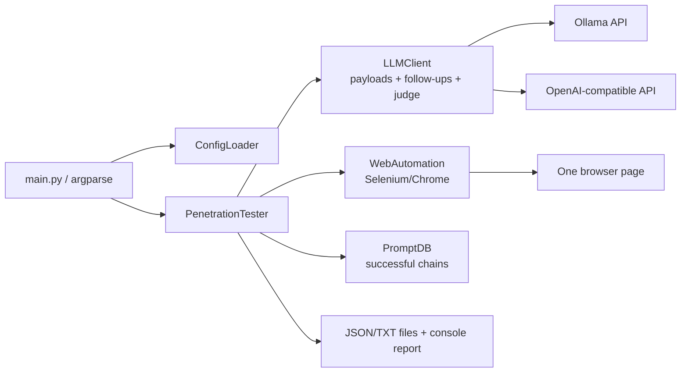

# Current architecture assessment

This assessment describes the repository at commit `b0e5bb4` on 2026-07-21. It is based on the source, configuration, and repository history; README statements are called out when the code does not support them. No live target or paid model was contacted.

## Executive summary

Stealth Prompt is currently a small, synchronous Python script for driving one Selenium-controlled Chrome page. One `LLMClient` talks to either Ollama's chat endpoint or an OpenAI-compatible `/chat/completions` endpoint. The same client generates attack messages, consumes complete target transcripts to generate follow-ups, and judges responses. A `PenetrationTester` owns the loop, terminal interaction, persistence, and reporting.

The useful seed functionality is the multi-turn loop, configurable Selenium selectors, OpenAI/Ollama transports, saved successful prompt chains, environment substitution, and JSON/TXT output. The central architectural problem is that transport, strategy, judgment, user interaction, and persistence are coupled through dictionaries and side effects. There is no target HTTP/API adapter, no deterministic oracle abstraction, no normalized result model, no repeatable experiment runner, and no automated test suite.

## Repository and module inventory

The repository has six Python modules, one example configuration, a README, and a UTF-16 LE `requirements.txt`. It has no package metadata (`pyproject.toml` or `setup.py`), test directory, CI configuration, or checked-in result examples.

| File | Current responsibility | Notable coupling |
| --- | --- | --- |
| `main.py` | `argparse` entry point, construction, dry run, browser lifecycle for a single test, result saving, exit handling | Reaches into `PenetrationTester.llm_client` and `.web_automation`; duplicates result insertion in single-test mode |
| `src/config_loader.py` | YAML loading, cwd `.env` loading, recursive `${VAR}` substitution, limited validation | Validates a monolithic legacy shape; does not validate selectors, output, turn bounds, or many value types |
| `src/llm_client.py` | Ollama/OpenAI HTTP calls, proxy construction, OpenAI response cache, payload generation, refusal/repetition heuristics, sensitive-data judging, detailed analysis | Provider transport, attack strategy, judge, logging, and cache are one class; attack prompts are hard-coded rather than using configured prompt templates |
| `src/web_automation.py` | Chrome/Selenium creation, selector lookup, prompt entry, click fallbacks, response extraction, proxy and certificate handling | Browser lifecycle, UI flow, TLS policy, selectors, logging, and target session are one class |
| `src/penetration_tester.py` | Composition root, attack loop, interactive confirmation, prompt-chain reuse, result model, persistence, reporting | Directly depends on concrete Selenium and LLM classes and raw configuration dictionaries |
| `src/prompt_db.py` | JSON persistence and migration of successful prompt/response chains; heuristic reuse and response matching | Stores protected responses alongside attack knowledge; mutates the database during load; doubles as an oracle |

## Runtime behavior

### Targets and target interaction

There is one effective target type: a web page opened in Chrome. `WebAutomation.start()` either launches Chrome and navigates to `web.url`, or attaches to an existing remote-debugging Chrome and uses its current page (`src/web_automation.py:452-481`). `send_prompt()` fills one configured input and clicks one configured submit element, falling back to Enter (`src/web_automation.py:483-568`). `get_response()` finds the first matching response element, sleeps two seconds, and reads `.text` (`src/web_automation.py:570-616`).

The target has no explicit session identifier. The same browser/page remains open across all configured tests, so target state can leak between tests. There is no deliberate session reset. Attaching to an existing Chrome is the only authentication-state mechanism.

`web.method` is stored and validated but never used. The top-level `http` block is not a target API configuration. `PenetrationTester` passes only `config["web"]` plus proxy settings into `WebAutomation`; consequently, the cookie lookup at `src/web_automation.py:463-468` cannot see the top-level `http.cookies` block. Headers and HTTP timeouts are unused.

### Payloads and attacks

The first message is selected in this order:

1. a caller-provided payload;
2. the first turn from the first saved successful chain for that test type;
3. an LLM-generated payload.

For later turns, `PromptDB.try_saved_chain()` supplies an exact payload-prefix continuation when possible; otherwise `LLMClient.generate_payload()` sends the full conversation to the attacker model. The generator contains hard-coded prompts for initial and follow-up attacks and special wording for three test types (`src/llm_client.py:480-685`). It uses simple recent-response word overlap and refusal keyword heuristics to change approach, and retries up to three times when the generated payload exactly repeats a previous payload.

`testing.max_turns` bounds the conversation. There is no static configured payload-sequence mode, structured planner response, objective model, evidence-aware planning, target-response size limit, token/cost budget, rate-limit handling, or target-unavailable state. A one-second delay is hard-coded between turns and two seconds between tests.

`testing.conversational_mode` is read and displayed but never changes execution. The configured `payload_generation` templates are unused.

The configured taxonomy (`data_extraction`, `prompt_injection`, `jailbreak_attempts`, `system_prompt_leakage`, and `unauthorized_access`) is a set of free-form labels, not executable scenario definitions. In particular, generic jailbreak testing can drift beyond the proposed protected-information disclosure scope unless it is reframed as a technique used toward a disclosure objective.

### Response analysis and success

Each response is checked first against values heuristically recovered from saved successful conversations. If that misses, the entire response is sent to the same configured attacker model with a binary string-label prompt. A substring check for `SENSITIVE_DATA_FOUND` determines the provisional boolean (`src/llm_client.py:688-729`).

When the model claims success, the full payload, target response, and analysis are printed and the CLI blocks for human confirmation. A confirmation stores the full conversation in `successful_prompts.json` and marks the run successful. A rejection continues. There is no standalone deterministic canary, regex, fragment, protected-document, callback, or composite oracle. There are only two effective final outcomes: `success` and `completed`; send/extraction failures are also reported as `completed`, not `error`.

The configured `sensitive_keywords` and `response_analysis` prompts are unused. `LLMClient.analyze_response()` exists but is not called by the runner.

### Selenium integration

Confirmed Selenium features are:

- Chrome/Chromium through `webdriver.Chrome`;
- headed or headless launch;
- window size, implicit wait, page-load timeout, response timeout, and click timeout;
- attach to a Chrome remote-debugging port for manually prepared state;
- ID, class, CSS, XPath, and name selectors;
- an optional parent selector for the submit button;
- click retries, JavaScript click fallback, and broad overlay dismissal attempts;
- optional unauthenticated Chrome proxy configuration.

Missing or unreliable behavior includes iframe selection, multiple-page flow, browser-context isolation, storage-state import/export, trace/HAR/network capture, screenshots, response correlation, streamed-response completion, and repeatable reset. Response extraction can return an older message on multi-turn pages because it neither records the previous element count/text nor selects the newest match. Fixed sleeps are used for readiness. Proxy authentication is explicitly incomplete.

The browser is always launched with certificate errors ignored, insecure content allowed, and `--no-sandbox` (`src/web_automation.py:101-111`). Certificate warning pages are also programmatically bypassed. These are unconditional launch defaults, not explicit test-target choices.

### API support

There is no HTTP target implementation. The only HTTP requests in the source are attacker-model calls made with `requests.post()`:

- Ollama: `{base_url}/api/chat`, non-streaming;
- OpenAI-compatible: `{base_url}/chat/completions`, non-streaming.

Target method, target headers, form/JSON body templates, response extraction, conversation ID capture, retries, SSE, TLS controls, and target proxy policy do not exist. README/config references to GET/POST and `http.headers` should not be interpreted as API-target support.

### Attacker-model providers

`llm.provider` accepts exactly `ollama` or `openai`. Both use synchronous `requests`; the OpenAI path is compatible with a configurable base URL but enforces an `sk-`-style API key, which unnecessarily rejects some OpenAI-compatible providers. Both send a system and user message and request non-streaming output. Only OpenAI responses are cached.

The provider is used for three distinct jobs: generate the initial payload, generate adaptive follow-ups, and judge target responses. There is no provider interface or dependency injection, no deterministic fake, no structured output parsing, and no usage/cost accounting. The runner silently transmits target responses to the configured provider for both judgment and later planning.

### Configuration format

The only format is one unversioned YAML document with top-level `llm`, `web`, `http`, `proxy`, `testing`, and `output` sections. Environment substitution recursively replaces `${VAR}` and `${VAR:-default}` in any string. A `.env` file is loaded from the process working directory, not relative to the configuration file.

Validation checks only required section presence, provider name, `web.method`, and enabled proxy URL/scope. It does not reject an empty YAML document cleanly, unknown keys, invalid selectors, invalid repetitions/turns, unresolved secrets outside the OpenAI key, unsafe TLS settings, bad output formats, or incompatible combinations.

Confirmed inert or misleading keys are:

- `web.method`;
- `web.selenium.wait_for_response`;
- all top-level `http` settings in the current composition path;
- `testing.conversational_mode` as a behavior switch;
- `testing.sensitive_keywords`;
- `testing.payload_generation`;
- `testing.response_analysis`;
- `output.save_analysis`;
- `output.save_responses` for normal conversation results (it is consulted only by a legacy TXT branch).

### Output and reporting

Normal results are a timestamp-named JSON list and/or a human-readable TXT file under `output.results_dir`. Each test contains `test_type`, conversation history, turn count, a boolean disclosure flag, a two-state status, and timestamp. Each turn stores full payload/response, the model explanation, and whether the prompt database matched. A console report aggregates count, success count, completed/failed count, and average turns by test type.

There is no run ID, target ID/adapter, objective, provider configuration snapshot, evidence list, confidence, normalized status, timings, errors/timeouts, screenshots, trace/HAR references, usage/cost, per-repetition directory, summary JSON, redacted console mode, or schema version. Output flags do not prevent sensitive response storage in the normal path.

In `main.py --test-type`, `run_test()` appends its own result and `main.py` appends it again (`main.py:83-85`, `src/penetration_tester.py:230`), so single-test output contains a duplicate.

### Tests and verification status

There are no unit or integration tests and no test framework configuration. `python3 -m compileall` succeeds, but the current host lacks the declared runtime dependencies, so the CLI was not exercised against a browser or model. The README does not declare a supported Python version and uses `python`, while the code requires Python 3. The UTF-16 requirements file is unusual and pins a full transitive environment rather than expressing a small set of direct dependencies.

## Technical debt and partial implementations

The highest-value partial implementations to preserve are:

- multi-turn conversation history and maximum-turn bound;
- simple repeated-response and refusal heuristics;
- saved successful chain replay and old-entry migration;
- configurable UI selectors and Chrome attach mode;
- OpenAI-compatible base URL and Ollama transports;
- environment substitution, proxy scaffolding, JSON/TXT serialization, and summaries.

The main debt is:

- **Concrete orchestration:** `PenetrationTester` constructs concrete LLM, Selenium, database, and file components; none can be replaced in tests.
- **Mixed responsibilities:** `LLMClient` is provider, strategy, judge, cache, and logger. `PenetrationTester` is runner, UI, result builder, reporter, and persistence layer.
- **Raw dictionaries:** configuration and results have no typed boundary or schema version, making unknown and inert settings silent.
- **Synchronous side effects:** network, sleeps, terminal prompts, and filesystem writes are embedded in the loop.
- **Duplicated policy:** URL/proxy parsing and logging are spread across modules; payload/response persistence exists in both results and the prompt database.
- **Fragile heuristics:** prompt-chain matching requires exact payload equality; `check_prompt()` hashes a prompt while current IDs hash whole chains; a log path still reads removed `chain_id`; response success is primarily an LLM assertion.
- **Error flattening:** send and response failures become normal completion, and broad exception handlers often print and continue.
- **Mutable load:** opening an old prompt database can rewrite it immediately without backup or atomic replacement.

## Documentation claims not supported by source

The README correctly describes Selenium, selector configuration, OpenAI/Ollama selection, environment substitution, and JSON/TXT results at a high level. The following claims are absent, incomplete, or misleading:

| Claim | Source reality |
| --- | --- |
| GET/POST target configuration | `web.method` is never used; no target request is made |
| Top-level HTTP headers/cookies | headers are unused; cookies are unreachable due to configuration slicing |
| URL validation prevents SSRF | validation checks only `http`/`https` syntax and allows loopback/private/arbitrary hosts; arbitrary authorized targets are also core to the tool |
| Selector sanitization prevents XSS | a substring filter rejects `<`, `>`, and `script`; model output is typed with Selenium and selectors are trusted configuration, so this is not a meaningful XSS control |
| Proper error handling avoids leakage | raw prompts, target responses, model responses, exception details, and model error bodies are printed |
| Output honors `save_responses`/`save_analysis` | normal conversation JSON/TXT stores responses regardless; analysis control is unused |
| Automatic SSL handling as a feature | Selenium TLS errors are bypassed unconditionally, reducing security rather than safely configuring trust |
| `payloads_per_type` | README names this key, but configuration/code use `tests_per_type` |

## Security risks in the current tool

Detailed controls and a target-state design are in `security-considerations.md`. The confirmed current risks are:

1. **Sensitive data disclosure through console and files (high).** Full target responses are printed during normal operation and again on a positive judge decision. Results and confirmed prompt chains store them in plaintext with ordinary process-umask permissions (currently repository files are mode `0644`). OpenAI cache entries can also contain target-derived judge/planner output.
2. **Silent external data sharing (high).** Complete target responses and conversation history are sent to the configured attacker model. There is no consent gate, minimization, redaction, or record of exactly what left the machine.
3. **A removed cookie remains in Git history (high if still valid).** Repository history confirms one non-empty `http.cookies` entry before commit `722a889`, even though the current file is empty. The value was not displayed during this assessment. It should be treated as exposed: rotate it and consider history cleanup with maintainer coordination.
4. **Unsafe browser defaults (high).** Certificate validation is effectively disabled, insecure content is allowed, and the Chrome sandbox is disabled for every newly launched test. A hostile target page therefore runs in a weakened browser process.
5. **Authentication/session exposure (high).** Existing-Chrome mode attaches to a manually authenticated browser over a debugging port and has no profile isolation, scope checks, or artifact policy. A local process able to reach that port may control the authenticated session. Cleanup calls `quit()` without distinguishing owned and attached browsers.
6. **Artifact and secret handling (medium/high).** `.env`, JSON results, and cache files are ignored by Git, but no restrictive directory/file mode, atomic write, encryption option, retention rule, or centralized redaction exists. Proxy credentials may be embedded in URLs. README permits hard-coded API keys as an alternative.
7. **TLS/proxy ambiguity (medium).** Attacker-model HTTP uses Requests' default TLS verification, while browser TLS is always insecure. Proxy scope `api` means attacker-model traffic, not a target API. Authenticated Chrome proxies are accepted in configuration but not actually supported.
8. **Untrusted content and logs (medium).** Target text and model output can inject terminal control characters or forge log lines. HTML is read as text and model payloads are sent as keystrokes, so there is no current direct shell/eval sink, but later HTML reporting must escape all content.
9. **Resource and state controls (medium).** Turns are bounded, but response length, total tokens/cost, retries, rate, and artifact size are not. Tests share one target session, which can contaminate evidence across test cases or users.
10. **Environment-loading inconsistency (medium).** `python-dotenv` normally preserves existing variables, while the fallback parser overwrites them. Both read `.env` from cwd, making behavior dependent on launch location.
11. **Unsafe default example target (medium).** The checked-in configuration points to a real non-loopback public service and enables attachment to an existing Chrome session. The CLI has no preflight authorization warning or local-first demo.

No subprocess, shell command, `eval`, `exec`, pickle, or model-controlled JavaScript execution was found. Selenium uses fixed JavaScript snippets with element arguments. Those non-findings should be preserved through the refactor.
