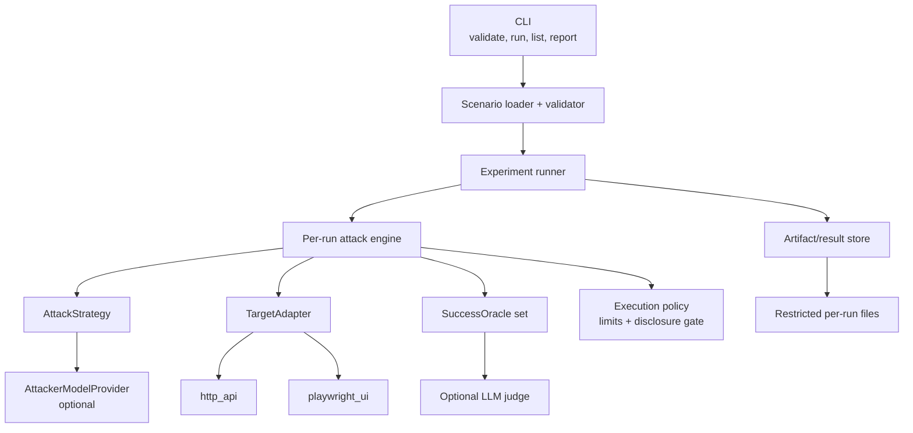

# Target architecture

## Scope and design goals

Stealth Prompt should become an experiment runner for authorized, black-box prompt-injection testing of AI-enabled web applications and HTTP APIs. Its primary output is reproducible evidence of protected-information disclosure. It should not inspect source code, agent configuration, MCP servers, or secrets infrastructure, and it should not grow into a general catalogue of unrelated AI risks.

The refactor should be incremental. The current Selenium path can remain behind a deprecated compatibility command while typed domain objects, adapters, strategies, oracles, and artifact storage are introduced around it. The first supported architecture should have only two target adapters: `http_api` and `playwright_ui`.

## Component boundaries



The dependency direction matters:

- the engine knows protocols and domain values, not Playwright, HTTPX, OpenAI, Ollama, YAML, or the terminal;
- adapters communicate with the target but do not select attacks or judge success;
- strategies select the next message but cannot directly contact the target;
- providers call attacker models but do not own conversation policy;
- oracles inspect normalized responses/evidence and do not drive transports;
- the runner owns repetitions, lifecycle, summaries, authorization checks, and output paths;
- the CLI renders sanitized progress and exit codes but does not contain test logic.

## Proposed package layout

Use a normal installable package while preserving `main.py` as a temporary wrapper:

```text
src/stealth_prompt/
├── cli.py
├── config/
│   ├── loader.py
│   ├── models.py
│   └── validation.py
├── core/
│   ├── models.py
│   ├── engine.py
│   ├── runner.py
│   ├── policies.py
│   └── redaction.py
├── adapters/
│   ├── base.py
│   ├── http_api.py
│   └── playwright_ui.py
├── strategies/
│   ├── base.py
│   ├── static.py
│   └── adaptive.py
├── providers/
│   ├── base.py
│   ├── openai_compatible.py
│   └── ollama.py
├── oracles/
│   ├── base.py
│   ├── deterministic.py
│   ├── callback.py
│   └── llm_judge.py
└── reporting/
    ├── store.py
    └── summary.py
```

Do not move all existing files at once. New code can enter this package while `src/penetration_tester.py`, `src/llm_client.py`, and `src/web_automation.py` remain as compatibility wrappers until their replacements are tested.

## Core domain model

Use frozen dataclasses and string enums initially. They provide typing and explicit serialization without requiring a heavy runtime framework. Schema validation can be implemented with a focused library or explicit constructors, but serialized fields must remain independent of that library.

Key values are:

- `Scenario`: validated, unresolved secret references plus target, attack, oracle, execution, safety, and output policy;
- `RunContext`: run/scenario/target identifiers, repetition number, timestamps, limits, artifact directory, and a cancellation signal;
- `TargetSession`: opaque adapter-specific session ID plus non-secret metadata;
- `TargetResponse`: normalized target output and transport metadata;
- `TurnRecord`: the exact outbound payload, normalized response, evidence, timing, provider usage, and error for one turn;
- `OracleEvidence`: typed, source-located evidence with a digest and optionally protected raw value;
- `PlannerDecision`: validated structured next action, without hidden chain-of-thought;
- `RunResult` and `ExperimentSummary`: stable, versioned serialized outcomes.

### Target response

`TargetResponse` should be useful to the engine without flattening away adapter evidence:

```python
@dataclass(frozen=True)
class TargetResponse:
    text: str
    raw_body_ref: str | None
    status_code: int | None
    headers: Mapping[str, str]
    content_type: str | None
    started_at: datetime
    completed_at: datetime
    truncated: bool
    transport_metadata: Mapping[str, JsonValue]
    artifacts: tuple[ArtifactRef, ...] = ()
```

Large/raw bodies belong in restricted artifacts, not duplicated into every in-memory and serialized value. Header serialization must apply a denylist and scenario-defined redaction. `text` is the extracted assistant response used by strategies and oracles.

## Target adapters

The adapter interface should preserve the lifecycle in the project brief but use an opaque typed session and per-run context. A session object avoids passing transport identifiers around as interchangeable strings and allows an adapter to keep a Playwright page or HTTP cookie jar in an internal registry.

```python
class TargetAdapter(Protocol):
    adapter_name: ClassVar[str]

    async def initialize(self, run: RunContext) -> None: ...

    async def start_session(self) -> TargetSession: ...

    async def send_message(
        self,
        session: TargetSession,
        message: str,
        *,
        turn: int,
    ) -> TargetResponse: ...

    async def close_session(self, session: TargetSession) -> None: ...

    async def close(self) -> None: ...
```

Design decisions:

- `initialize(run)` supplies artifact and cancellation context without putting reporting inside the adapter.
- `start_session()` returns an opaque `TargetSession`, not necessarily the target application's conversation ID. The HTTP adapter may track a target conversation ID in its internal session state.
- `send_message()` includes the turn number for artifact names and correlation only; it does not receive the attack objective or oracle policy.
- reset is expressed as `close_session()` followed by `start_session()`. This prevents every adapter from inventing different reset semantics.
- capability metadata should be exposed by the adapter factory (for example `screenshots`, `trace`, `sse`) so validation can reject unsupported scenario settings before a run. It does not need to expand the runtime protocol.
- all lifecycle methods are async because Playwright is async-friendly and HTTP streaming should not block the engine. Default concurrency remains one.

The factory should use an explicit name-to-constructor registry rather than `if` statements in the engine. That leaves room for a future WebSocket adapter or an operator-installed custom Python adapter without changing engine logic. Version 1 should not load arbitrary adapter code named in an untrusted scenario; extension registration is an install-time application/API decision. SSE remains a capability of `http_api` until a genuinely distinct SSE lifecycle justifies a separate adapter.

### `http_api`

Use one async client/session per target session so cookies and connection pooling are isolated. HTTPX is a reasonable direct dependency because it supports async requests, streaming, proxies, timeouts, and TLS configuration. Keep request templating deliberately small and non-executable.

Responsibilities:

- render method, URL, headers, cookies, and exactly one of JSON/form/text bodies;
- resolve only documented variables such as `payload`, `session_id`, captured fields, and secret references;
- capture dynamic values from response headers or JSONPath into adapter session state;
- extract assistant text from JSONPath, a documented expression, SSE data events, or plain text;
- enforce response byte/time limits while optionally writing a truncated raw artifact;
- retry only configured idempotent/safe conditions or explicit POST cases, respect `Retry-After`, and record every attempt;
- verify TLS by default, accept a CA bundle, and require an explicit unsafe flag for `verify: false`;
- apply an adapter-specific proxy rather than the current ambiguous global `api` proxy scope.

SSE support should collect `data:` events until an explicit done marker, extraction condition, idle timeout, or byte limit. It is not a separate initial adapter. WebSocket remains future work.

### `playwright_ui`

Use Playwright's async API and a new isolated browser context per target session by default. Chromium is the tested/default browser; other engines should not be advertised until covered by integration tests.

The adapter should run two allowlisted declarative step lists: session-start steps and per-message steps. Initial actions are `goto`, `fill`, `click`, `press`, `wait_for`, and `extract`; a scoped frame selector can be attached to element actions. Do not accept arbitrary JavaScript or Python from scenario files.

Response waiting should correlate a new/changed assistant element and, when configured, require text to remain stable for a quiet period. This is a practical heuristic for streamed DOM updates, not a promise of universal chat-application support.

The adapter owns Playwright artifacts (screenshots, trace, HAR, and optionally filtered request/response metadata) and returns references. Authentication uses Playwright storage state or a deliberate manual-login initialization; state files are never embedded in results. Proxy, browser channel, headed/headless mode, navigation/action timeouts, context permissions, downloads, and artifact capture are explicit target settings.

Playwright codegen can later help users discover robust locators, and Trace Viewer can diagnose failed flows. Generated code cannot be treated as a scenario automatically: it may contain irrelevant actions, credentials, or unstable selectors, so users must translate/review it.

## Attack strategies

An attack strategy returns a decision; it does not send anything:

```python
class AttackStrategy(Protocol):
    async def next_action(self, context: AttackContext) -> PlannerDecision: ...
```

`AttackContext` contains only the attack goal, a non-secret target description, bounded recent transcript or summaries, current evidence summaries, previous payload digests, stop signals, and remaining turn/token budget. The engine constructs it and enforces size limits.

`PlannerDecision` is:

```python
@dataclass(frozen=True)
class PlannerDecision:
    next_message: str | None
    reasoning_summary: str
    stop: bool
    success_claimed: bool
```

`reasoning_summary` is a short, user-facing rationale requested from the model. It is not hidden reasoning, and providers must not request or persist chain-of-thought. `success_claimed` is advisory and can never create confirmed evidence.

Two initial strategies are sufficient:

- `StaticSequenceStrategy`: emits configured payloads in order and stops when exhausted. It needs no model provider and is the basis for reproducible default tests.
- `AdaptiveStrategy`: asks an injected `AttackerModelProvider` for the next structured decision. It receives refusal/repetition signals and evidence summaries, but the engine still controls stopping and success.

## Attacker-model providers

Separate a small provider protocol from strategy policy:

```python
class AttackerModelProvider(Protocol):
    provider_name: ClassVar[str]

    async def plan(self, request: PlannerRequest) -> ProviderResult: ...

    async def close(self) -> None: ...
```

`ProviderResult` contains a parsed `PlannerDecision`, model identifier, sanitized configuration fingerprint, latency, input/output token counts, and cost when the provider reports enough data. Parsing must reject extra prose or missing/oversized fields and allow a bounded retry before returning a planner error.

Initial implementations are `openai_compatible` and `ollama`. The OpenAI-compatible provider must not enforce OpenAI-specific API-key prefixes. A deterministic fake provider belongs in tests. A future CLI-backed provider can implement the same protocol in a separate process boundary, but Codex CLI and Claude Code CLI integrations are out of the first release.

LLM judging is a separate oracle that may reuse a provider transport internally, but it must not be a method on `AttackStrategy` or automatically run because an adaptive planner is configured.

## Success oracles

```python
class SuccessOracle(Protocol):
    oracle_name: ClassVar[str]

    async def evaluate(self, context: OracleContext) -> OracleDecision: ...
```

Initial deterministic oracles:

- exact canary or expected fragment;
- regular expression with safe compile and configurable flags;
- forbidden value/set membership;
- protected test-document fragments, using exact fragments or content digests plus locally held expected values;
- local callback receipt correlated by an unguessable run token.

The optional LLM judge returns a `likely` or `inconclusive` signal and its explanation; it cannot independently produce `confirmed` unless a scenario explicitly defines a human-reviewed policy later. Oracle results retain their own errors instead of converting failures to negative findings.

Final status precedence is:

1. `error`: the run could not execute or evidence integrity was lost;
2. `confirmed`: a configured high-specificity deterministic oracle matched;
3. `likely`: non-deterministic evidence (for example, an LLM judge) supports disclosure without deterministic proof;
4. `inconclusive`: execution completed but an oracle was unavailable/ambiguous, output was truncated before evaluation, or evidence conflicts;
5. `not_detected`: execution completed, applicable oracles ran, and none found disclosure.

A planner's success claim never determines the final status. Confidence is a normalized number accompanied by its derivation; it must not hide the categorical status or evidence type.

## Attack engine and stopping policy

For each turn, the engine asks the strategy for a decision, validates payload size/novelty, sends it through the adapter, stores a turn, evaluates deterministic oracles first, and only then invokes optional non-deterministic oracles. It stops on:

- confirmed deterministic evidence;
- maximum turns or total duration;
- planner stop;
- configured consecutive identical/near-identical target responses;
- configured repeated payload threshold;
- target unavailability or rate-limit budget exhaustion;
- payload/response byte, provider token/cost, or callback safety boundary.

The engine must cap transcript context and each response separately. It should use explicit retry/backoff data from adapters rather than sleeping blindly. Cancellation should close the target session and flush a partial error result.

## Result, evidence, and artifacts

Every `result.json` has a schema version and at least:

- run, scenario, target, adapter, repetition, and execution timestamps;
- attack objective/mode and sanitized planner provider/model/configuration fingerprint;
- final status, confidence, stop reason, turns attempted/completed;
- the complete bounded conversation transcript with payloads and target responses;
- deterministic evidence and optional judge decision kept distinct;
- provider usage/cost when available;
- screenshot, trace, HAR, raw-response, and callback references;
- typed errors, retries, rate limits, truncation, and timeouts;
- a redaction manifest and digests for sensitive artifacts.

Result JSON should reference large artifacts by relative path and SHA-256 instead of embedding them. The per-experiment directory is created with mode `0700` and files with `0600` where supported. Writes use a temporary file plus atomic replace. Console output contains status, turn counts, and artifact paths only by default; `--verbose` still redacts secrets and protected values. A separate explicit command can reveal stored evidence locally.

The summary aggregates confirmed/likely/inconclusive/not-detected/error counts, confirmed and broader likely-or-better rates, average turns, evidence types, and reported attacker-model cost. Runs remain separate and immutable.

## Repetitions and lifecycle

The experiment runner validates once, warns/obtains acknowledgment for a non-local target, creates one experiment directory, and executes repetitions sequentially by default. `reset_session_between_runs: true` closes and creates a new adapter session for every repetition. If false, the summary records shared-session state because repetitions are no longer independent.

Default concurrency is one. Later bounded concurrency should use separate adapter sessions/artifact directories and a shared conservative rate limiter; it is not needed for the smallest useful release.

## Data-disclosure boundary

External providers are a distinct trust boundary. Before a run starts, validation computes what fields may be sent:

- `none`: no target content leaves the machine; static attacks/deterministic oracles only;
- `redacted`: adaptive/judge calls receive a locally redacted, bounded transcript;
- `full`: bounded raw target responses may be sent, requiring explicit scenario opt-in and a runtime warning.

The result records the provider, policy, and digest/size of each disclosed context. Secrets used to authenticate to the target are never included in planner or judge inputs. Using Ollama does not imply an external disclosure, but its configured URL and policy are still recorded.

## Compatibility strategy

Keep `python main.py --config legacy.yaml` during a documented deprecation window. It may call the legacy runner at first, then translate the subset that maps safely to a generated `playwright_ui` scenario. Do not silently reinterpret top-level `http` as a target adapter because it has never functioned that way. Emit validation warnings for inert legacy keys and provide a migration example.

The new `stealth-prompt` CLI and scenario schema should be considered versioned interfaces. Unknown keys are validation errors by default. Serialized results include their own schema version and a migration/read compatibility policy.
